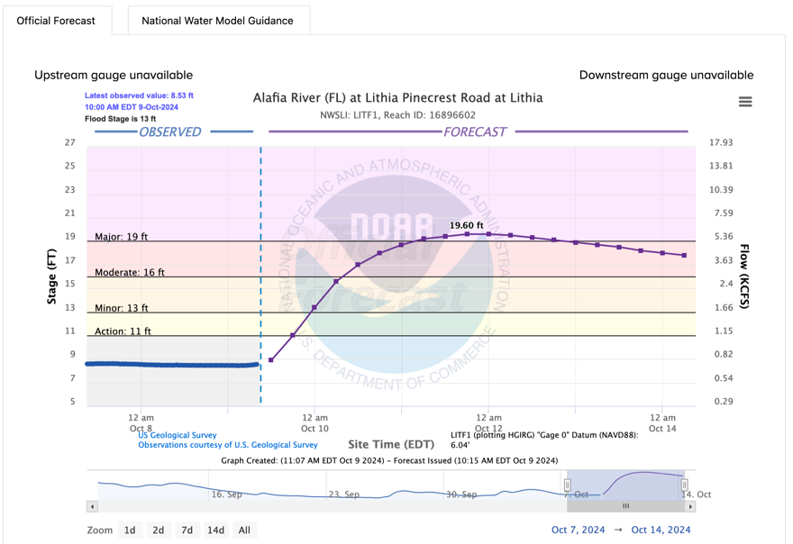

## Additional Details

### Experimental Design

| Parameter | Specification |
|-----------|---------------|
| **Spatial Domain** | Subset of CAMELS catchments that are forecast by RFC combined with additional RFC headwater catchments (up to 5 locations per RFC domain) |
| **Validation Period** | 5 years of daily hindcasts from approximately 6Z (corresponding to RFC initializations), 2017-2022 |
| **Lead Times** | 1-7 days |
| **Timesteps** | Daily, 6-hourly, hourly |

### Reference Capabilities

The following baseline systems are used for comparison:

1. **RFC Streamflow Forecasts** - Operational forecasts from NWS River Forecast Centers
2. **NWM 3.0** - NOAA National Water Model version 3.0 streamflow forecasts
3. **NextGen NWM** - NextGen-based NWM default short-range configuration
4. **Persistence Forecast** - Simple persistence baseline

*Example short-range streamflow forecast from NOAA's Southeast River Forecast Center (SERFC). NOAA-RFC forecasts serve as a reference capability against which to benchmark new innovations.*

### Performance Metrics

- **Peak flow magnitude and timing** - Accuracy of flood peak predictions
- **Modified KGE** - Kling-Gupta Efficiency of forecast flow for each lead time
- **Cumulative flow volume** - Volume accuracy at each daily lead time (days 1-7)
- **CRPS** - Continuous Ranked Probability Score for ensemble forecasts
- **ETS** - Equitable Threat Score for flow versus defined thresholds (e.g., flood stages)

Scores are also expressed with respect to reference capability performance.

### Other Considerations

- Computational demand of innovation
- Stability of dependencies (method, dataset)
- Potential operational latency
- Extent of existing documentation and published research
- Potential for forecaster training and real-time support
- Dependency on proprietary resources or methods

### Related Publications

- Cosgrove, B, and many authors including A.W. Wood, 2022. NOAA's National Water Model: Advancing Operational Hydrology Through Continental-Scale Modeling. *Journal of the American Water Resources Association* (in review).
- McEnery, J., J. Ingram, Q. Duan, T. Adams, and L. Anderson, 2005: NOAA'S ADVANCED HYDROLOGIC PREDICTION SERVICE. *Bulletin of the American Meteorological Society*, 86, 375-386, https://doi.org/10.1175/BAMS-86-3-375.
